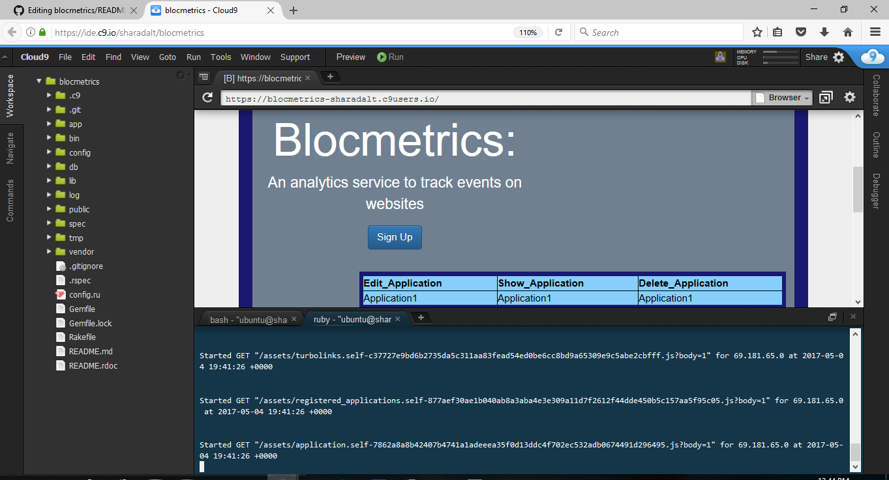

<h1>Blocmetrics</h1>
There are plenty of good analytic services, but that doesn't mean you can't build a better one. 

Blocmetrics analytics service will offer a few key features:

    A client-side JavaScript snippet that allows a user to track events on their website.
    A server-side API that captures and saves those events to a database.
    A Rails application that displays the captured event data for a user.
 

<h2>Use Case </h2>

 For the use case, goto the link,  https://sharadalt.github.io/portfolio/blokmetrics
 
 
<h2>Configuration</h2>

    

 

<h2>How to run it </h2>

To start the application you run it like any other rails application with the command, first start the rails server
 $ rails s and goto the localhost:3000, to make sure the app is running locally.
 
 On Cloud9 running rails is as below: 
 
 $ rails s -p $PORT -b $IP
 
 And to make sure the app is running, click on preview tab and select 'Preview Running application'.
